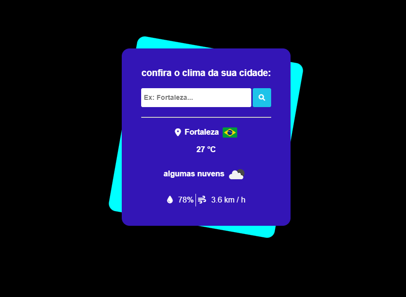
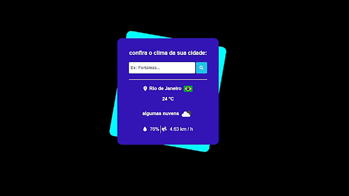

<h1 align="center">
    Confira o clima da sua cidade.
</h1>

  

## 💻 Descrição 

Este projeto é uma aplicação que verifica o clima de uma cidade, providenciando dados como têmperatura, humidade, velocidade do vento e etc. feito com HTML, CSS e javascript, utilizando o fetch com weather-api para fornecimento de dados das cidades, uso do localStorage como armazenamento para criação de um historico de pesquisa dinâmico. Design simples, sem protótipo.

## 🚀 Tecnologias

- HTML
- CSS
- JavaScript
- [Weather-API](https://openweathermap.org/api)

## preview

  

